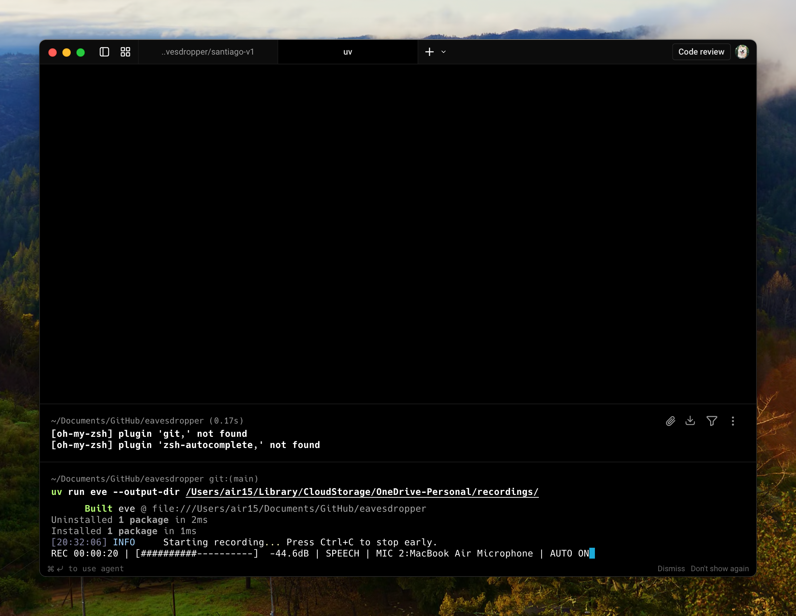
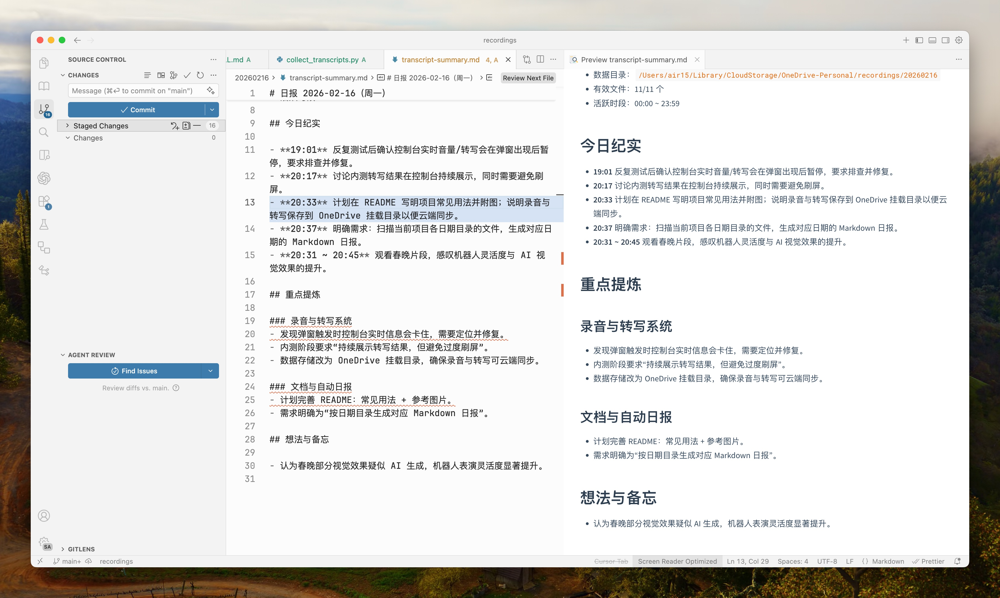

# eve

`eve` 全称为 `eavesdropper`。

一个跨平台的麦克风长时间录音工具：实时录音并自动转写，默认使用 Qwen3-ASR；VAD 仅保留有人说话的部分并只对说话段做转写。eve 面向需要“长时间、低打扰、可检索”录音的场景，提供持续录音、分段存储与实时转写，适用于会议记录、访谈纪要、学习复盘与个人日志等。

## 引言

> 好吧，数字化时代，我承认它离我们还比较遥远。在我能够真正的数字化飞升之前，我决定把我的声音完完整整地保留下来。所以，我开发了这个产品，帮我全天二十四小时不间断地监听我的声音。对，所以我有两个比较重点的东西：一个是会一直保存我的录音，另一个是提供数字转写的能力。可能现在的 AI 模型还不够强大，那些能力也没有那么强，所以先留着录音，等以后有升级的识别或更强的语音识别模型再处理。现在也支持关闭 ASR，先录音后用 `eve-transcribe` 异步处理历史音频。

## 功能特性

- 长时间连续录音：面向全天或多小时录制场景。
- 自动分段存储：按时间切片生成 WAV 文件，便于管理与回放。
- 实时转写：录音过程中持续输出转写文本（JSON）。
- VAD 语音检测：仅保留有人说话的片段，减少无效内容。
- 麦克风自动切换：可自动探测并切到当前“有声”的输入设备。
- 轻量控制台反馈：单行音量条与状态提示，便于确认正在正常录音。
- 日志式归档：录音与转写按日期归档，便于检索与复盘。
- ASR 可关闭：支持离线/异步转写已有录音。

## OneDrive 云端同步（常见用法）

将输出目录设为 OneDrive 的本地下载目录后，录音 `.wav` 和同名转写 `.json`
会一起写入该目录（按日期归档），并由 OneDrive 自动同步到云端。

```bash
uv run eve --output-dir /Users/air15/Library/CloudStorage/OneDrive-Personal/recordings/
```



也可以把该目录中的转写内容交给其他 AI 生成日报（如 `transcript-summary.md`）：

```text
请读取 /Users/<你的用户名>/Library/CloudStorage/OneDrive-Personal/recordings/YYYYMMDD/ 下的转写 JSON，
按时间线整理“今日纪实、重点提炼、待办事项”，输出为 Markdown 文件 transcript-summary.md。
```



## 快速上手

### 1) 环境要求

- Python >= 3.12
- [uv](https://docs.astral.sh/uv/)（推荐，用于依赖与运行）

```bash
brew install uv
```

### 2) 安装与运行

在项目根目录执行：

```bash
uv sync
uv run eve
```

若已创建并激活虚拟环境，也可：

```bash
uv venv .venv
source .venv/bin/activate   # Windows: .venv\Scripts\activate
uv sync
eve
```

### 3) 默认行为

- 总时长 24 小时，每 60 分钟切一段
- 录音与 JSON 按日期归档到 `recordings/YYYYMMDD/`
- 文件名形如 `eve_live_YYYYMMDD_HHMMSS.wav`
- 同名 `.json`（如 `eve_live_YYYYMMDD_HHMMSS.json`）实时追加转写结果
- 使用 Silero VAD，仅保留有人说话的片段并只对说话段做转写
- 默认开启 ASR，可通过 `--disable-asr` 仅录音

## 常用用法

### 列出音频设备

```bash
eve --list-devices
```

用 `--device` 选择麦克风（默认 `default`），支持设备索引、设备名或 `:索引`：

```bash
eve --device 2
eve --device "Built-in Microphone"
```

默认已开启“有声麦克风自动切换”：

```bash
eve
```

需要更严格防抖时可调高确认次数和切换冷却时间：

```bash
eve \
  --auto-switch-confirmations 3 \
  --auto-switch-cooldown-seconds 12
```

如需关闭自动切麦：

```bash
eve --no-auto-switch-device
```

如果不希望显示实时音量条：

```bash
eve --no-console-feedback
```

### 自定义输出与分段

```bash
eve --output-dir recordings --segment-minutes 30 --total-hours 3
```

### 录音但不转写（关闭 ASR）

```bash
eve --disable-asr
```

### 异步转写已有录音

```bash
eve-transcribe --input-dir recordings
```

持续监听新文件并转写：

```bash
eve-transcribe --input-dir recordings --watch
```

### 调整音频参数

音频参数已固定为：WAV / 16kHz / 单声道。

## 配置参数一览

下表按类别列出所有配置参数及默认值，便于快速查阅。

### 设备与输出

| 参数 | 说明 | 默认值 |
| --- | --- | --- |
| `--device` | 麦克风设备（索引 / 名称 / `:索引`） | `default` |
| `--output-dir` | 录音输出目录 | `recordings` |
| `--device-check-seconds` | 麦克风可用性检测间隔（秒，<=0 关闭） | `2` |
| `--device-retry-seconds` | 麦克风异常后重试间隔（秒） | `2` |
| `--auto-switch-device` / `--no-auto-switch-device` | 自动切换到当前有声输入设备 | `true` |
| `--auto-switch-scan-seconds` | 自动切换扫描间隔（秒） | `3` |
| `--auto-switch-probe-seconds` | 每个候选设备的探测时长（秒） | `0.25` |
| `--auto-switch-max-candidates-per-scan` | 每次扫描最多探测的候选麦克风数量 | `2` |
| `--exclude-device-keywords` | 录音默认选设备与自动切换时要忽略的设备名关键词（逗号分隔） | `iphone,continuity` |
| `--auto-switch-min-rms` | 候选麦克风被判定为“有声”的最小 RMS | `0.006` |
| `--auto-switch-min-ratio` | 候选设备相对当前设备的最小音量倍率 | `1.8` |
| `--auto-switch-cooldown-seconds` | 两次切换间的最短冷却时间（秒） | `8` |
| `--auto-switch-confirmations` | 同一候选设备连续胜出的次数阈值 | `2` |
| `--console-feedback` / `--no-console-feedback` | 开关控制台单行录音反馈 | `true` |
| `--console-feedback-hz` | 控制台反馈刷新频率（Hz） | `12` |

### 录音时长与分段

| 参数 | 说明 | 默认值 |
| --- | --- | --- |
| `--total-hours` | 总录音时长（小时） | `24` |
| `--segment-minutes` | 分段时长（分钟） | `60` |

### 音频格式

固定为：WAV、16kHz、单声道。

### VAD

使用 Silero VAD 过滤无声片段，仅对“有人说话”的部分做转写。
输出 JSON 中包含每段说话的系统时间戳和对应转写文本。

为保证“边说边转写”，单段说话连续时长默认会在 20 秒处强制切段。

### 工具

| 参数 | 说明 | 默认值 |
| --- | --- | --- |
| `--list-devices` | 列出可用设备并退出 | `false` |

### ASR 模型与设备

| 参数 | 说明 | 默认值 |
| --- | --- | --- |
| `--disable-asr` | 关闭实时转写，仅录音 | `false` |
| `--asr-model` | Qwen3-ASR 模型 ID 或本地路径 | `Qwen/Qwen3-ASR-0.6B` |
| `--asr-language` | 语言名称或 `auto` 自动检测 | `auto` |
| `--asr-device` | 推理设备（auto / cuda:0 / mps / cpu） | `auto` |
| `--asr-dtype` | 计算精度（auto / float16 / bfloat16 / float32） | `auto` |

### ASR 推理

| 参数 | 说明 | 默认值 |
| --- | --- | --- |
| `--asr-max-new-tokens` | 解码最大新 token 数 | `256` |
| `--asr-max-batch-size` | 推理批大小 | `1` |
| `--asr-preload` | 录音前预加载模型 | `false` |

## ASR 依赖

ASR 转写为可选功能，依赖已包含在默认安装中。仅在实时转写或使用 `eve-transcribe` 时需要：

```bash
uv sync
```

关闭 ASR 时仅录音，不会加载模型；后续可用 `eve-transcribe` 异步生成 `.json` 转写结果。

## 其他说明

- 录音基于 `sounddevice`，设备列表以 `eve --list-devices` 输出为准。
- 运行中若麦克风不可用，会按 `--device-retry-seconds` 间隔自动重试。
- 默认会按阈值和防抖策略在输入设备间自动切换，可用 `--no-auto-switch-device` 关闭。
- 默认会忽略名称包含 `iphone`、`continuity` 的输入设备，避免 Continuity 麦克风断连导致频繁中断；可用 `--exclude-device-keywords` 自定义。
- 默认会显示单行音量条（覆盖刷新，不刷屏）；可用 `--no-console-feedback` 关闭。
- 启用 ASR 时，控制台会固定两行区域刷新：第一行显示录音状态，第二行单独显示最近转写历史（不刷屏）。
- 运行中按 `Ctrl+C` 可提前停止；也可直接执行 `python -m eve` 代替 `eve`。

## 输出 JSON 结构（示例）

每个音频段对应一个同名 JSON，录音与转写过程中会持续追加 `speech_segments` 并更新 `text`、`language`、`status`：

```json
{
  "audio_file": "eve_live_20260201_120513.wav",
  "audio_path": "/path/to/recordings/20260201/eve_live_20260201_120513.wav",
  "segment_start": "20260201_120513",
  "segment_start_time": "2026-02-01T12:05:13+08:00",
  "model": "Qwen/Qwen3-ASR-0.6B",
  "backend": "transformers",
  "created_at": "2026-02-01T04:05:18.132908+00:00",
  "device": null,
  "dtype": null,
  "input_device": "2:Built-in Microphone",
  "auto_switch_device": true,
  "asr_enabled": true,
  "asr_mode": "live",
  "status": "ok",
  "speech_segments": [
    {
      "start_time_iso": "2026-02-01T12:05:14.200000+08:00",
      "end_time_iso": "2026-02-01T12:05:16.700000+08:00",
      "language": "Chinese",
      "text": "不宜长时间久坐，请升起升降桌。"
    }
  ],
  "language": "Chinese",
  "text": "不宜长时间久坐，请升起升降桌。"
}
```

- `device`、`dtype` 为 ASR 实际使用的设备与精度，未加载模型前可为 `null`。
- `input_device` 为该段录音实际使用的输入设备（索引:设备名）。
- `auto_switch_device` 表示该段录音是否启用了自动切麦。
- `asr_mode` 为 `"live"`（实时转写）、`"disabled"`（仅录音）或 `"offline"`（离线转写）。
- `status` 录音中为 `"recording"`，结束后可能为 `"ok"`、`"pending_asr"`、`"no_speech"` 或 `"no_text"`。
- 离线转写会输出 `start_seconds` / `end_seconds`（相对音频文件），不会包含实时录音的绝对时间戳。
