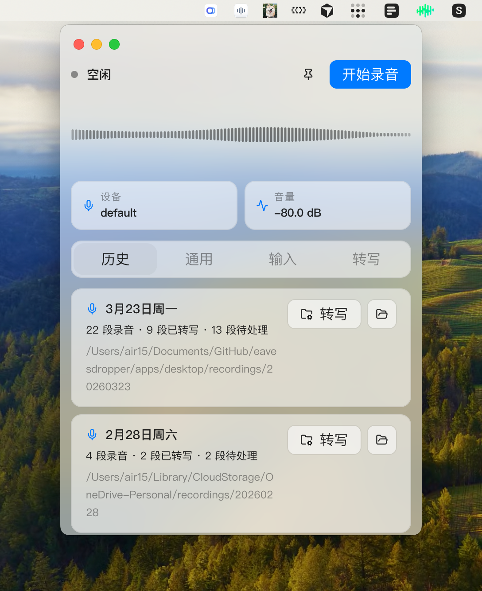
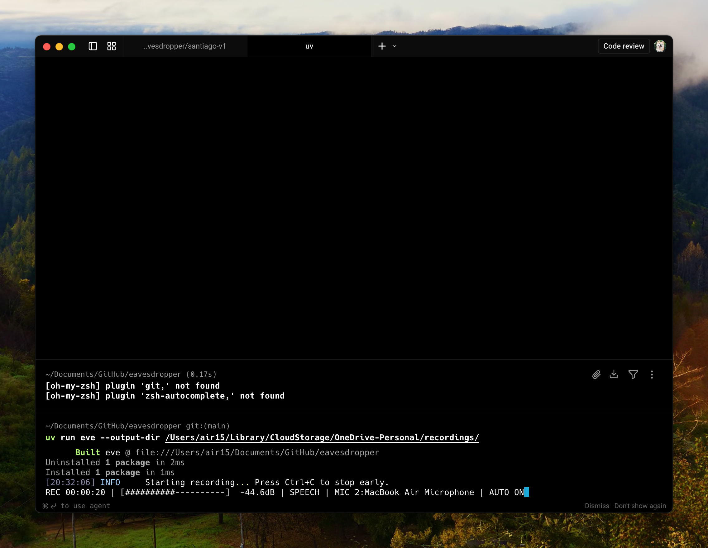
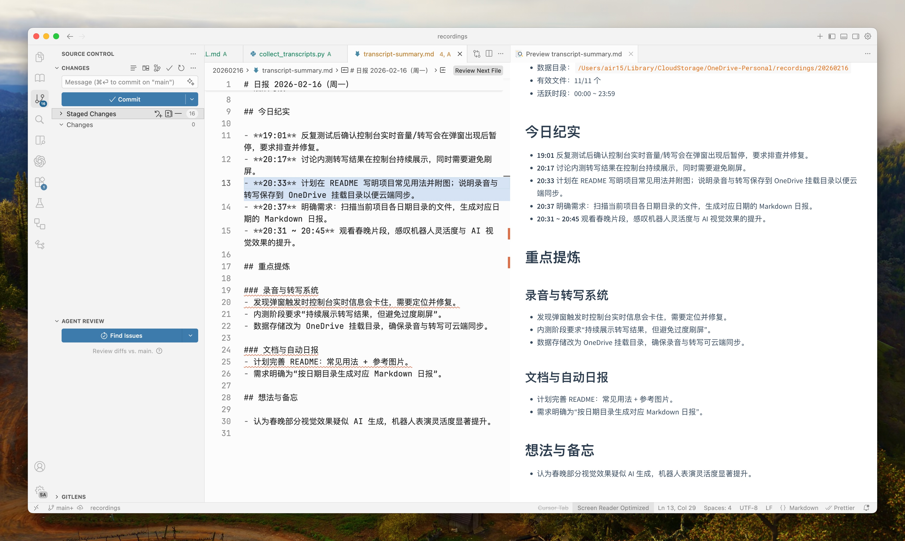

# eve

English | [中文](README.zh.md)

`eve` stands for `eavesdropper`.

A cross-platform long-running microphone recording tool: real-time recording with automatic transcription, using Qwen3-ASR by default; VAD keeps only speech segments and transcribes only those parts. eve is designed for scenarios requiring "long-duration, low-distraction, searchable" recordings — meetings, interviews, study reviews, and personal journals.

## Introduction

> OK, the digital age — I admit it's still a long way off. Before I can truly ascend into the digital realm, I've decided to preserve my voice in its entirety. So I built this tool to monitor my voice 24/7. Two key things: it continuously saves my recordings, and it provides digital transcription. Current AI models may not be powerful enough yet, so I'll keep the recordings and reprocess them when better speech recognition models arrive. You can also disable ASR and use `eve transcribe` later to process historical audio offline.

## Features

- Long-running continuous recording: designed for all-day or multi-hour sessions.
- Automatic segmented storage: time-sliced FLAC (lossless) files for easy management and playback.
- Real-time transcription: continuously outputs transcription text (JSON) during recording.
- VAD speech detection: keeps only segments with speech, reducing noise.
- Automatic microphone switching: detects and switches to the currently active input device.
- Desktop client: Electron + React desktop app with system tray and auto-start support.
- Lightweight console feedback: single-line volume bar and status indicator to confirm recording is active.
- Log-style archiving: recordings and transcriptions archived by date for easy retrieval.
- ASR can be disabled: supports offline/async transcription of existing recordings.

## Desktop Preview



## Download

Download the latest desktop client from GitHub Releases:

- Release page: [nexmoe/eve Releases](https://github.com/nexmoe/eve/releases)
- macOS: download the latest `.pkg` installer
- Windows: download the latest `.exe` installer

The desktop client supports automatic update checks, background download, and install-on-quit after an update finishes downloading.

## OneDrive Cloud Sync (Common Usage)

Set the output directory to your OneDrive local folder — `.flac` (or `.wav`) recordings and their matching `.json` transcriptions will be written there (archived by date) and automatically synced to the cloud by OneDrive.



You can also feed the transcriptions to an AI to generate daily reports (e.g., `transcript-summary.md`):

```text
Read the transcription JSONs from /Users/<your-username>/Library/CloudStorage/OneDrive-Personal/recordings/YYYYMMDD/,
organize them into "daily log, key takeaways, action items" by timeline, and output as transcript-summary.md.
```



## Default Behavior

- Total duration: 24 hours, segmented every 60 minutes
- Recordings and JSON archived to `recordings/YYYYMMDD/`
- Filenames like `eve_live_YYYYMMDD_HHMMSS.flac`
- Matching `.json` (e.g., `eve_live_YYYYMMDD_HHMMSS.json`) with real-time transcription appended
- Silero VAD keeps only speech segments and transcribes only those
- ASR enabled by default; use `--disable-asr` for recording only

## Output JSON Structure (Example)

Each audio segment has a matching JSON file. During recording and transcription, `speech_segments` are appended and `text`, `language`, `status` are updated:

```json
{
  "audio_file": "eve_live_20260201_120513.flac",
  "audio_path": "/path/to/recordings/20260201/eve_live_20260201_120513.flac",
  "segment_start": "20260201_120513",
  "segment_start_time": "2026-02-01T12:05:13+08:00",
  "model": "Qwen/Qwen3-ASR-0.6B",
  "status": "ok",
  "speech_segments": [
    {
      "start_time_iso": "2026-02-01T12:05:14.200000+08:00",
      "end_time_iso": "2026-02-01T12:05:16.700000+08:00",
      "language": "Chinese",
      "text": "不宜长时间久坐，请升起升降桌。"
    }
  ],
  "language": "Chinese",
  "text": "不宜长时间久坐，请升起升降桌。"
}
```

## Notes

- If the microphone becomes unavailable during recording, it will automatically retry.
- Auto-switch uses threshold + debounce strategy; iPhone/Continuity devices are ignored by default.
- With ASR enabled, the console refreshes two fixed lines: recording status and recent transcription history.
- Press `Ctrl+C` to stop early.

## More Documentation

- [CLI Reference](docs/cli.md) — Full command-line parameters and usage
- [Development Guide](docs/development.md) — Environment setup, building, and CI/CD
